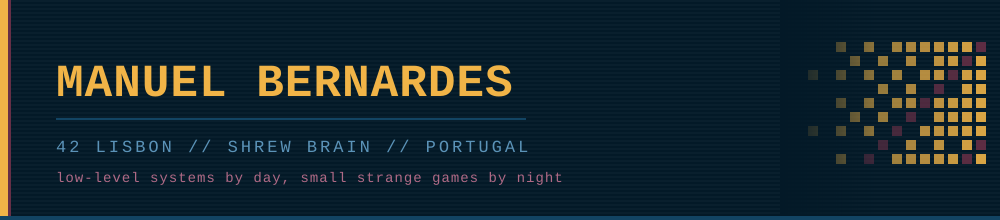
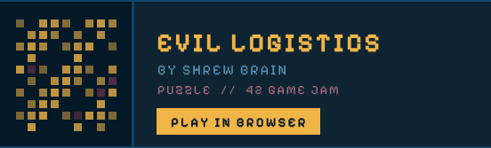

  
  
  
  
  

 

# GAMES BY [SHREWBRAIN](https://shrewbrain.itch.io/)

 

## Tools

| | | |
|:--|:--|:--|
| **[MDpad](https://manucovr.github.io/MDpad)** | Markdown editor with live preview | Vanilla JS |
| **[PDFbox](https://manucovr.github.io/pdfbox)** | PDF toolkit — merge, split, compress, convert | Vanilla JS |
| **[Regexa](https://manucovr.github.io/regexa)** | Regex explainer with live match highlighting | Vanilla JS |

 

## 42 Lisbon

| | |
|:--|:--|
| **[Transcendence](https://github.com/martimsaunders/transcendence)** | Full-stack web app, real-time multiplayer, auth, microservices |
| **[Inception](https://github.com/ManuCovr/Inception)** | Docker, containerization, service orchestration |
| **[CPP Modules 00–09](https://github.com/ManuCovr/CPP)** | OOP, inheritance, polymorphism, templates, STL, exceptions |
| **[Cub3D](https://github.com/bbento-a/42-Cub3D)** | 3D raycasting engine, texturing, collision detection |
| **[Philosophers](https://github.com/ManuCovr/Philo)** | Multithreading, mutexes, deadlock prevention |
| **[Minishell](https://github.com/bbento-a/ProjectMinishell)** | Shell parsing, environment variables, process control |
| **[Pipex](https://github.com/ManuCovr/pipex)** | UNIX piping, process forking, file descriptors |
| **[Push Swap](https://github.com/ManuCovr/push_swap)** | Sorting algorithms, stack operations, complexity limits |
| **[So Long](https://github.com/ManuCovr/so_long)** | 2D game logic, pathfinding, rendering |
| **[GetNextLine](https://github.com/ManuCovr/getnextline)** | Buffered file reading, static variables, dynamic memory |
| **[Libft](https://github.com/ManuCovr/libft)** | Standard library reimplementation |

